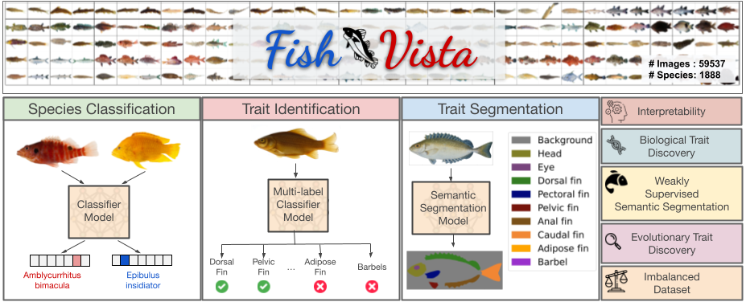

# Fish-Vista
This repo contains the benchmarking code for the paper Fish-Vista: A Multi-Purpose Dataset for Understanding and Identification of Traits from Images

| [**🤗 Dataset**](https://huggingface.co/datasets/imageomics/fish-vista) | [**GitHub**](https://github.com/sajeedmehrab/Fish-Vista/tree/main) |



## Introduction
The Fish-Visual Trait Analysis (Fish-Vista) dataset is a large, annotated collection of 60K fish images spanning 1900 different species; it supports several challenging and biologically relevant tasks including species classification, trait identification, and trait segmentation. These images have been curated through a sophisticated data processing pipeline applied to a cumulative set of images obtained from various museum collections. Fish-Vista provides fine-grained labels of various visual traits present in each image. It also offers pixel-level annotations of 9 different traits for 2427 fish images, facilitating additional trait segmentation and localization tasks.

The Fish Vista dataset consists of museum fish images from Great Lakes Invasives Network (GLIN), iDigBio, and Morphbank databases. We acquired these images, along with associated metadata including the scientific species names, the taxonomical family the species belong to, and licensing information, from the Fish-AIR repository.

## Code
Please refer to our [code](code)
 folder for more details.

## Contact
- Kazi Sajeed Mehrab: ksmehrab@vt.edu
- Anuj Karpatne: karpatne@vt.edu

## Citation
Please refer to our [dataset card citation section](https://huggingface.co/datasets/imageomics/fish-vista#citation)

**BibTeX:**
```bibtex
@misc{<ref_code>,
  author = {Kazi Sajeed Mehrab and M. Maruf and Arka Daw and Harish Babu Manogaran and Abhilash Neog and Mridul Khurana and Bahadir Altintas and Yasin Bakış and Elizabeth G Campolongo and Matthew J Thompson and Xiaojun Wang and Hilmar Lapp and Wei-Lun Chao and Paula M. Mabee and Henry L. Bart Jr. and Wasila Dahdul and Anuj Karpatne},
  title = {Fish-Vista: A Multi-Purpose Dataset for Understanding \& Identification of Traits from Images},
  year = {2024},
  url = {https://huggingface.co/datasets/imageomics/fish-vista},
  doi = {<doi once generated>},
  publisher = {Hugging Face}
}

```
Please be sure to also cite the original data sources using the citations provided [here](https://huggingface.co/datasets/imageomics/fish-vista/blob/main/metadata/data-bib.bib)

**Funding Sources**

This work was supported by the [Imageomics Institute](https://imageomics.org), which is funded by the US National Science Foundation's Harnessing the Data Revolution (HDR) program under [Award #2118240](https://www.nsf.gov/awardsearch/showAward?AWD_ID=2118240) (Imageomics: A New Frontier of Biological Information Powered by Knowledge-Guided Machine Learning). Any opinions, findings and conclusions or recommendations expressed in this material are those of the author(s) and do not necessarily reflect the views of the National Science Foundation.
